# BlogAgent

[](https://github.com/RaulMermans/BlogAgent/actions/workflows/ci.yml)


**Evidence-aware editorial drafting system for source-grounded blog articles.**

BlogAgent explores how generative writing can be wrapped inside deterministic workflow control: query contracts, source scoring, recommendation candidate validation, claim checks, structured handoffs, and a final copy-readiness contract.

It is built as an internal editorial drafting workflow, not an autopublishing platform or public SaaS product.

---

## Overview

Generic AI writing tools can produce fluent articles, but they often fail at the layer that matters most for editorial credibility: proving that claims, citations, and recommendations are actually grounded.

BlogAgent was designed around a stricter premise:

> The article should be downstream from evidence, not the other way around.

Before a draft is produced, the system builds a structured research and validation layer. For recommendation-style articles, it also creates a locked candidate set so the writer cannot silently invent products, change the requested count, or treat irrelevant source text as a recommendation.

---

## What it proves

BlogAgent demonstrates:

- bounded AI workflow design
- source-grounded editorial drafting
- deterministic control around LLM output
- recommendation candidate validation
- claim and citation checking
- structured agent handoffs
- final-answer contract design
- mock-safe testing and CI
- internal tool/product architecture
- human-in-the-loop editorial review design

The project is not valuable because it writes blog posts.

It is valuable because it shows how generative writing can be constrained by evidence, contracts, validation, and review.

---

## Core principle

### Evidence first. Article second.

The workflow separates research, source evaluation, candidate validation, drafting, revision, and final readiness checks.

The LLM does not freely decide what is true, what should be recommended, or whether the output is ready. Those decisions are governed by deterministic contracts and validators.

```mermaid
flowchart LR
    A[User Topic] --> B[Query Contract]
    B --> C[Research Layer]
    C --> D[Source Extraction]
    D --> E[Source Scoring]
    E --> F[Evidence Table]
    F --> G[Candidate Ledger]
    G --> H[CandidatePack]
    H --> I[Writer Handoff]
    I --> J[Draft]
    J --> K[Review + Revision]
    K --> L[Claim Check]
    L --> M[Final Answer Contract]
    M --> N[Reviewed Draft Package]
```



---

## Product snapshot

BlogAgent produces a structured editorial package:

- article markdown
- SEO title
- slug
- meta description
- SEO keywords
- source list
- claim support summary
- recommendation candidate ledger
- copy-readiness status
- internal trace for review

For recommendation prompts, the article is generated from a validated candidate pack rather than from open-ended model generation.

---

## Key system ideas

### Query Contract

Before drafting begins, BlogAgent builds a `QueryContract` that locks the topic’s task type, domain, requested count, answer shape, and evidence requirements.

A counted recommendation prompt cannot silently degrade into a generic answer.

---

### Candidate Ledger

For recommendation-style articles, BlogAgent extracts candidate entities from source material before the writer drafts.

The candidate ledger rejects:

- bylines
- dates
- navigation text
- source titles
- category phrases
- unsupported recommendations
- truncated product names
- brand-only names when a specific product is required

Only validated candidates can move into the locked recommendation set.

---

### CandidatePack

`CandidatePack` is the recommendation authority.

It defines:

- which candidates may appear
- how many candidates may appear
- what source supports each candidate
- whether the requested count can be satisfied
- whether the article must be treated as evidence-limited

The writer receives a deterministic skeleton based on this pack.

---

### Structured Agent Handoffs

Article-producing stages exchange typed artifacts instead of free-form agent conversation.

```txt
QueryContract
→ EntityCandidateLedger
→ CandidatePack
→ WriterHandoff
→ WriterOutputAudit
→ ReviewPacket
→ RevisionPlan
→ RevisionOutputAudit
→ PolishHandoff
→ PolishOutputAudit
→ LockedRepair
→ FinalAnswerContract
```

This makes the workflow easier to inspect, test, and constrain.

---

### Claim and Citation Checks

BlogAgent extracts factual claims from the draft and classifies them against available evidence.

Claim statuses:

- `supported`
- `partially_supported`
- `unsupported`

The default citation matcher is deterministic and heuristic. A semantic citation judge can be enabled internally for stronger per-claim support checks.

---

### Final Answer Contract

The `FinalAnswerContract` is the final readiness arbiter.

It checks structural and evidence integrity after drafting, revision, polish, and grounding.

Failure examples:

| Check | Failure means |
|---|---|
| Requested count is not satisfied | Output is not copy-ready |
| Article contains unsupported recommendations | Output is not copy-ready |
| Quick Picks count mismatches body count | Output is not copy-ready |
| Title promises more items than the article contains | Output is not copy-ready |
| Recommendation appears without source grounding | Output is not copy-ready |

User-facing readiness labels:

| Internal status | User-facing label |
|---|---|
| `publish_ready` | Copy-ready |
| `publish_ready_with_editorial_review` | Copy-ready after light review |
| `draft_only_not_publish_ready` | Needs revision before use |

Every status still assumes human editorial review before manual publishing.

---

## Concrete failure this solves

During testing, a watch recommendation workflow incorrectly treated **“Paul Altieri”** — a dealer/reviewer name — as a product recommendation alongside real watch models.

BlogAgent now catches this class of error before drafting through the candidate integrity gate.

That behavior is locked with a regression test:

```txt
test_affordable_luxury_watches_no_paul_altieri
```

This is the central lesson of the project: the solution was not better prompting. It was better evidence control.

---

## Architecture

BlogAgent uses a hybrid deterministic/LLM architecture.

| Layer | Responsibility |
|---|---|
| Deterministic workflow | Order, schemas, limits, validation, final readiness |
| Search provider layer | Mock-safe by default, live provider optional |
| Source extraction | Extracts usable source text |
| Source scoring | Scores source quality deterministically |
| Editor Agent | Research planning, outline, draft, revision |
| Fact-Check Evaluator | Claim extraction and claim judgment |
| Candidate Ledger | Validates recommendation entities before drafting |
| CandidatePack | Locks the recommendation authority |
| Final Answer Contract | Determines final copy-readiness |
| Internal interface layer | Local/API/UI scaffolding for controlled use |

---

## Project highlights

| Area | Highlights |
|---|---|
| Workflow control | Deterministic graph, bounded stages, strict ordering |
| Evidence model | Source extraction, source scoring, claim support summaries |
| Recommendation integrity | Candidate ledger, CandidatePack, post-draft recommendation audit |
| Agent design | Editor Agent and Fact-Check Evaluator with constrained roles |
| Revision model | Bounded revision and polish passes |
| Safety posture | No autonomous publishing, no external side effects |
| Testing | Mock-safe tests and deterministic evals in CI |
| Deployment posture | Designed for internal use, not public unrestricted generation |

---

## Testing and CI

BlogAgent is designed to be mock-safe by default.

CI validates the deterministic pipeline without requiring paid provider keys.

The workflow checks:

- linting
- unit tests
- deterministic evals
- Python version compatibility

This keeps the repository reviewable as a public portfolio artifact without exposing secrets or requiring live-provider access.

---

## Safety model

BlogAgent is internal editorial drafting, not autonomous publishing.

Safety constraints:

- no CMS publishing
- no social posting
- no scheduling
- no email sending
- no external side effects
- no invented URLs
- no invented citations
- no raw scraped webpage text returned in public-facing responses
- high-risk topics can degrade to evidence reports
- human editorial review required before use

The first workflow guardrail checks for publishing, posting, sending, or scheduling language. If detected, the article workflow is blocked.

---

## Public repository note

This repository is published as a portfolio reference.

The public version focuses on architecture, workflow design, safety model, and implementation quality. Cost-bearing provider usage and operational deployment details are intentionally kept outside the public README.

---

## Limitations

BlogAgent is intentionally scoped.

Current limitations:

- Mock mode is the public-safe default.
- Mock drafts are structured but not production-ready.
- Live-provider quality is not guaranteed by mock-mode CI.
- Citation matching is heuristic unless semantic judging is enabled.
- Candidate extraction depends on available source text.
- Domain adapters may need new examples for niche categories.
- There is no persistence layer yet.
- The lightweight demo gate is not production authentication.
- `publish_ready` means the draft passed automated checks, not that it is factually perfect.
- Human review is always required.

See:

```txt
docs/limitations.md
```

---

## Project structure

```txt
blogagent/
  agents/       Editor Agent and Fact-Check Evaluator
  evals/        Eval cases, runner, and graders
  llm/          Provider selection, schemas, mock fallback
  tools/        Source scoring, validators, candidate pack, contracts
  workflow/     State models, pipeline nodes, graph runner

api/
  index.py      Internal API / deployment scaffold

app/ui/
  streamlit_app.py

docs/
  limitations.md
  portfolio-case-study.md
  eval_plan.md

examples/
  sample outputs and run traces

tests/
  pytest suite
```

---

## Portfolio case study

A deeper write-up of the product decisions, architecture trade-offs, failure cases, and lessons learned is available here:

```txt
docs/portfolio-case-study.md
```

---

## Portfolio summary

BlogAgent is a portfolio project about editorial reliability in AI-assisted writing.

It shows how a generative system can be made more trustworthy by placing the model inside a bounded workflow: evidence first, draft second, validation always.
